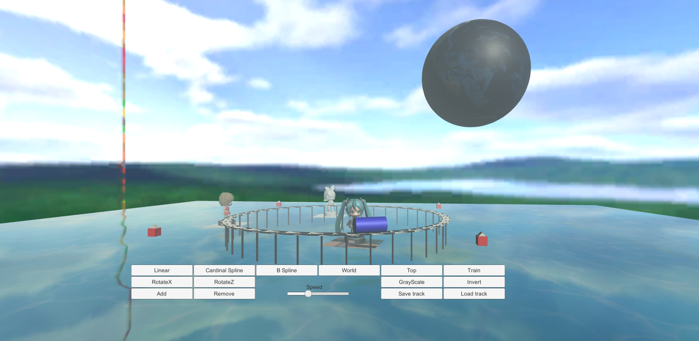
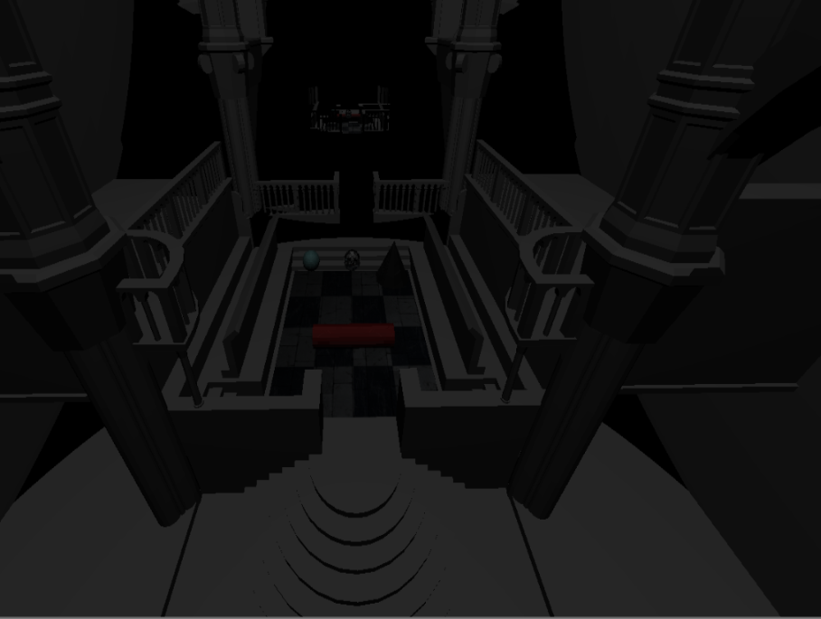
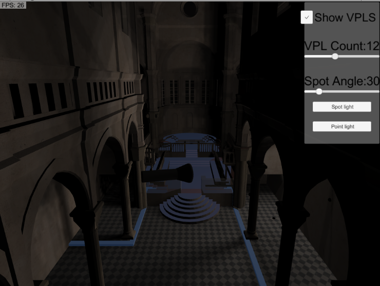
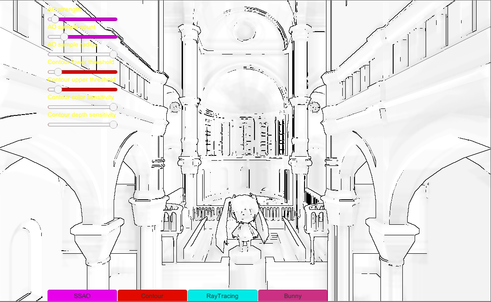

# NTUST 3d game technology
# Table of Contents
* Background
* Install&Usage
* Feature
# Background
學習電腦圖學渲染與全域光照、區域光照相關技術。
# Install&Usage
安裝Unity 2018.3.6並開啟專案。
# Feature
1. Rollercoaster: 課程入門考試，使用Unity完成電腦圖學課程的Amusement park。
  

2. Raytracer: 以平面螢幕座標作為射線射出點，在3D空間計算與物體及光源交集，並取出材質、燈光顏色，最後渲染成靜態圖片。 
 

3. Incremental instant radiosity: 從任意位置向周圍作Raycast並產生VPL(Virtual point light)，並計算個別VPL的shadow map，渲染場景的全域光照。 
 

4. Sceen space ambient occlusion: 使用Fragment shader實作SSAO，隨機取樣鄰近piexl的depth buffer差值計算遮蔽程度。另外，根據mesh資訊計算silouette和suggestive contours。 
 
